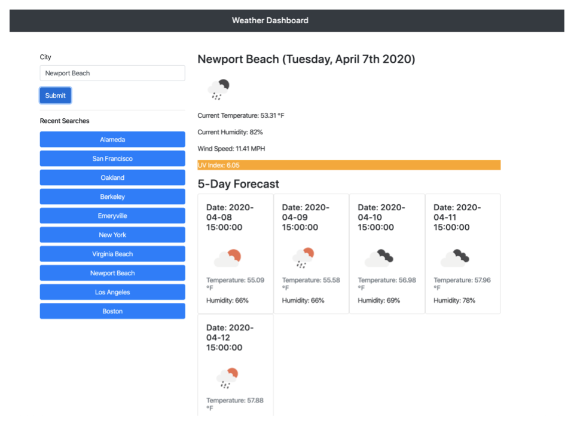

# Weather Dashboard

https://guillermo-martin.github.io/weatherDashboard/

## Description
<!-- * What does the app do? -->
The app gives the current weather and five day forecast for a city of their choice. When a user types in a city in the input box and clicks on the submit button, the current weather and the five day forecast will display. The city the user searched for will also appear in a "Recent Searches" section right below the submit button. The cities in the "Recent Searches" section are also clickable and will display the current weather and five day forecast when clicked. The app utilizes data obtained through OpenWeather's API and is dynamically created and rendered into the HTML file using JavaScript. For the UV index, if the index is less than or equal to 2, the UV is favorable and will be displayed as green; if the index is between 3 and 7, the UV is moderate and will be displayed as orange; and if the index is greater than or equal to 8, the UV is extreme and will display as red.

## Technologies
* Languages, frameworks, various tools
    * HTML, CSS, JavaScript, jQuery, Bootstrap 4, OpenWeather API, and Moment.js.

## Challenges
* Your experience building this app
    * I had a nice time building this app.  I thought it was neat looking at all the data obtained from OpenWeather's API.
* What was difficult
    * One of the difficult parts I had was getting the five day forecast to display properly.  If another city was searched right after searching a city, the five day forecast would append to the previous five day forecast results.
    * I also had difficulty limiting the number of searches to appear in the "Recent Searches" section.  The list would keep growing and growing whenever a search was made.  Another issue I had was preventing the same city from showing up in the "Recent Searches" section.
* What did you learn
    * I learned how to better navigate through the data obtained from an API.
    * I also learned about using "encodeURIComponent()" and "decodeURI()".
    * I learned about using ".shift()" with arrays.
    * I also learned that the jQuery version included with Bootstrap 4 doesn't support AJAX requests.
* How did you go about solving a problem
    * I would Google the particular problem or error message I was getting.
    * I utilized the console to see what issues I was having.
    * I also attended office hours and worked with a tutor.

## Screenshot

